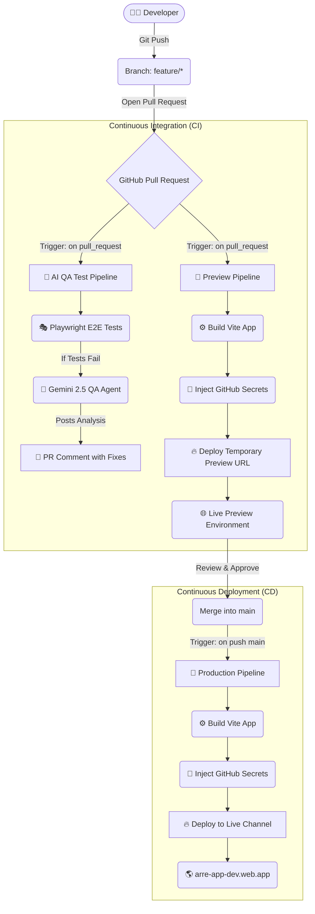

Arre uses GitHub Actions for continuous integration and deployment, featuring an AI-powered QA agent that analyzes test failures and provides automated debugging insights.

## Pipeline Overview

The CI/CD architecture consists of three main workflows:



## Workflows

### 1. AI QA Agent Pipeline

**File**: `.github/workflows/qa-agent.yml`

**Trigger**: Pull request opened or updated

**Purpose**: Run E2E tests and provide AI-powered failure analysis

<Steps>
  <Step title="Checkout code">
    Fetches the PR branch with full git history for diff generation:
    
    ```yaml
    - uses: actions/checkout@v4
      with:
        fetch-depth: 0
    ```
  </Step>

  <Step title="Install dependencies">
    Sets up Node.js, installs npm packages, and Playwright browsers:
    
    ```yaml
    - name: Install dependencies (root)
      run: npm ci
    
    - name: Install dependencies (functions)
      run: cd functions && npm ci
    
    - name: Install Playwright Browsers
      run: npx playwright install --with-deps
    ```
  </Step>

  <Step title="Set up Firebase Emulators">
    Installs Java 21 required for Firebase Emulators:
    
    ```yaml
    - name: Set up Java 21
      uses: actions/setup-java@v4
      with:
        distribution: "temurin"
        java-version: "21"
    ```
  </Step>

  <Step title="Run Playwright tests">
    Executes tests in emulator environment:
    
    ```yaml
    - name: Run Playwright tests
      run: CI=true npx firebase emulators:exec "npx playwright test --project=chromium" --project demo-test
      continue-on-error: true
    ```
    
    <Note>
      `continue-on-error: true` ensures the AI agent runs even when tests fail.
    </Note>
  </Step>

  <Step title="Run AI QA Agent">
    If tests fail, Gemini 2.5 analyzes the failure:
    
    ```yaml
    - name: Run AI QA Agent
      run: node scripts/qa-agent.js
      env:
        GEMINI_API_KEY: ${{ secrets.GEMINI_API_KEY }}
        GITHUB_TOKEN: ${{ secrets.GITHUB_TOKEN }}
        PR_NUMBER: ${{ github.event.pull_request.number }}
    ```
  </Step>
</Steps>

#### AI QA Agent Features

The Gemini 2.5-powered QA agent:

- **Analyzes test failures** - Reads error logs, stack traces, and test reports
- **Reviews code changes** - Examines git diff to understand what changed
- **Provides root cause analysis** - Identifies why tests failed
- **Suggests fixes** - Posts actionable debugging steps as PR comments
- **Learns from context** - Uses full repository context for accurate insights

<CodeGroup>
```javascript scripts/qa-agent.js (excerpt)
const testResults = JSON.parse(fs.readFileSync('test-results.json'));
const gitDiff = execSync('git diff origin/main').toString();

const analysis = await gemini.analyze({
  testResults,
  gitDiff,
  traces: './test-results/',
  prompt: 'Analyze test failures and provide debugging guidance'
});

await github.rest.issues.createComment({
  owner: process.env.REPO_OWNER,
  repo: process.env.REPO_NAME,
  issue_number: process.env.PR_NUMBER,
  body: analysis
});
```
</CodeGroup>

<Warning>
  The AI agent requires a `GEMINI_API_KEY` secret. Without it, tests still run but automated analysis is skipped.
</Warning>

### 2. Preview Deployment

**File**: `.github/workflows/firebase-hosting-pull-request.yml`

**Trigger**: Pull request opened or updated

**Purpose**: Deploy temporary preview environment for visual testing

<Tabs>
  <Tab title="Workflow">
    ```yaml
    name: Deploy to Firebase Hosting on PR
    on: pull_request
    
    jobs:
      build_and_preview:
        runs-on: ubuntu-latest
        steps:
          - uses: actions/checkout@v4
          
          - name: Build
            run: npm ci && npm run build
            env:
              VITE_FIREBASE_API_KEY: ${{ secrets.VITE_FIREBASE_API_KEY }}
              VITE_FIREBASE_AUTH_DOMAIN: ${{ secrets.VITE_FIREBASE_AUTH_DOMAIN }}
              VITE_FIREBASE_PROJECT_ID: ${{ secrets.VITE_FIREBASE_PROJECT_ID }}
          
          - uses: FirebaseExtended/action-hosting-deploy@v0
            with:
              repoToken: ${{ secrets.GITHUB_TOKEN }}
              firebaseServiceAccount: ${{ secrets.FIREBASE_SERVICE_ACCOUNT_ARRE_APP_DEV }}
              projectId: arre-app-dev
              expires: 6h
    ```
  </Tab>

  <Tab title="Preview URL">
    Firebase generates a unique preview URL:
    
    ```
    https://arre-app-dev--pr-123-abc123.web.app
    ```
    
    The URL is automatically posted as a PR comment for easy testing.
    
    **Expires after**: 6 hours
  </Tab>
</Tabs>

### 3. Production Deployment

**File**: `.github/workflows/firebase-hosting-merge.yml`

**Trigger**: Code merged to `main` branch

**Purpose**: Deploy to live production site

<CodeGroup>
```yaml .github/workflows/firebase-hosting-merge.yml
name: Deploy to Firebase Hosting on merge
on:
  push:
    branches:
      - main

jobs:
  build_and_deploy:
    runs-on: ubuntu-latest
    steps:
      - uses: actions/checkout@v4
      
      - name: Install dependencies
        run: npm ci
      
      - name: Install dependencies (functions)
        run: cd functions && npm ci
      
      - name: Build
        run: npm run build
        env:
          VITE_FIREBASE_API_KEY: ${{ secrets.VITE_FIREBASE_API_KEY }}
          VITE_FIREBASE_AUTH_DOMAIN: ${{ secrets.VITE_FIREBASE_AUTH_DOMAIN }}
          VITE_FIREBASE_PROJECT_ID: ${{ secrets.VITE_FIREBASE_PROJECT_ID }}
          VITE_FIREBASE_STORAGE_BUCKET: ${{ secrets.VITE_FIREBASE_STORAGE_BUCKET }}
          VITE_FIREBASE_MESSAGING_SENDER_ID: ${{ secrets.VITE_FIREBASE_MESSAGING_SENDER_ID }}
          VITE_FIREBASE_APP_ID: ${{ secrets.VITE_FIREBASE_APP_ID }}
      
      - name: Deploy Firebase Backend
        uses: w9jds/firebase-action@master
        with:
          args: deploy --only firestore,functions --force
        env:
          GCP_SA_KEY: ${{ secrets.FIREBASE_SERVICE_ACCOUNT_ARRE_APP_DEV }}
          PROJECT_ID: arre-app-dev
      
      - uses: FirebaseExtended/action-hosting-deploy@v0
        with:
          repoToken: ${{ secrets.GITHUB_TOKEN }}
          firebaseServiceAccount: ${{ secrets.FIREBASE_SERVICE_ACCOUNT_ARRE_APP_DEV }}
          channelId: live
          projectId: arre-app-dev
```
</CodeGroup>

#### Deployment Steps

<Steps>
  <Step title="Build application">
    Vite compiles the app with production optimizations:
    
    ```bash
    npm run build
    ```
    
    Output: `dist/` directory with static assets
  </Step>

  <Step title="Deploy backend">
    Updates Firestore rules, indexes, and Cloud Functions:
    
    ```bash
    firebase deploy --only firestore,functions --force
    ```
  </Step>

  <Step title="Deploy hosting">
    Uploads static assets to Firebase Hosting:
    
    ```bash
    firebase deploy --only hosting
    ```
    
    Live at: `https://arre-app-dev.web.app`
  </Step>
</Steps>

## Environment Variables

All sensitive configuration is stored in **GitHub Secrets**:

| Secret | Description |
|--------|-------------|
| `VITE_FIREBASE_API_KEY` | Firebase project API key |
| `VITE_FIREBASE_AUTH_DOMAIN` | Firebase Auth domain |
| `VITE_FIREBASE_PROJECT_ID` | Firebase project ID |
| `VITE_FIREBASE_STORAGE_BUCKET` | Firebase Storage bucket |
| `VITE_FIREBASE_MESSAGING_SENDER_ID` | FCM sender ID |
| `VITE_FIREBASE_APP_ID` | Firebase app ID |
| `FIREBASE_SERVICE_ACCOUNT_ARRE_APP_DEV` | Service account for deployment |
| `GEMINI_API_KEY` | API key for AI QA agent |

<Warning>
  Never commit `.env` files or hardcode secrets in source code. All environment variables must be injected at build time via GitHub Secrets.
</Warning>

### Setting Secrets

<Steps>
  <Step title="Navigate to repository settings">
    Go to **Settings** > **Secrets and variables** > **Actions**
  </Step>

  <Step title="Add new secret">
    Click **New repository secret**
  </Step>

  <Step title="Enter name and value">
    - Name: `VITE_FIREBASE_API_KEY`
    - Value: `AIzaSy...`
  </Step>

  <Step title="Save">
    Click **Add secret**
  </Step>
</Steps>

## Security & Best Practices

### 12-Factor App Methodology

The build process enforces strict separation of config from code:

- ✅ Environment variables injected at build time
- ✅ No plaintext secrets in repository
- ✅ Different configs for dev/preview/production
- ✅ Zero-trust deployment via service accounts

### Service Account Authentication

Deployments use Firebase service accounts instead of personal credentials:

```yaml
env:
  GCP_SA_KEY: ${{ secrets.FIREBASE_SERVICE_ACCOUNT_ARRE_APP_DEV }}
```

This ensures:
- No human credentials in CI/CD
- Fine-grained permission control
- Audit trail for all deployments

### CI/CD Configuration

Optimal settings for stability:

| Setting | Value | Reason |
|---------|-------|--------|
| `workers` | 1 on CI | Prevents race conditions |
| `retries` | 2 on CI | Handles flaky tests |
| `forbidOnly` | true on CI | Prevents accidental `.only()` merges |
| `reporter` | JSON + HTML | Enables AI analysis |

## Rollback Strategy

Firebase Hosting retains deployment history. To rollback:

<Steps>
  <Step title="Open Firebase Console">
    Navigate to [Firebase Console](https://console.firebase.google.com/project/arre-app-dev)
  </Step>

  <Step title="View hosting releases">
    Go to **Build** > **Hosting** > **Release history**
  </Step>

  <Step title="Select previous version">
    Click on the stable release
  </Step>

  <Step title="Rollback">
    Click **Rollback** to restore the previous version
  </Step>
</Steps>

<Note>
  Rollbacks take effect immediately. No rebuild required.
</Note>

## Monitoring & Debugging

### View Workflow Runs

Check CI/CD status in GitHub:

1. Go to **Actions** tab
2. Select workflow (QA Agent, Preview, Production)
3. View logs for each step

### Test Reports

Playwright generates HTML reports:

```bash
# View locally after test run
px playwright show-report
```

On CI, reports are available as artifacts.

### AI QA Comments

When tests fail, the AI agent posts comments like:

> **Test Failure Analysis**
>
> **Failed Test**: `should create a manual task`
>
> **Root Cause**: The `btn-create-task` button is disabled because the form validation is now requiring a date field, which was added in commit `abc123`.
>
> **Suggested Fix**:
> 1. Update test to fill the date field before clicking create
> 2. Or make the date field optional in the validation schema
>
> **Code Reference**: `src/components/NewTaskModal.tsx:145`

## Next Steps

<CardGroup cols={2}>
  <Card title="Testing Guide" icon="flask-vial" href="/development/testing">
    Learn how to write and run Playwright tests
  </Card>
  <Card title="Deployment" icon="rocket" href="/development/deployment">
    Manual deployment and production operations
  </Card>
</CardGroup>