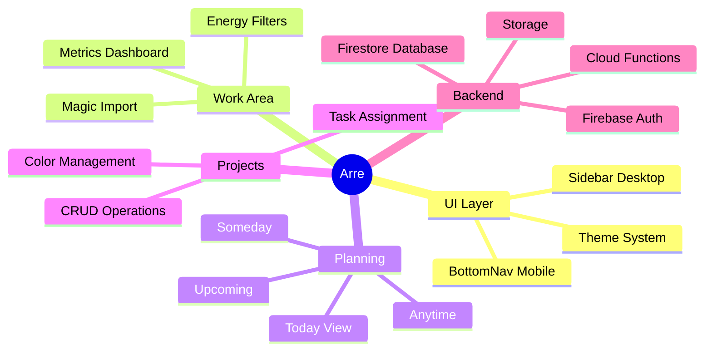

# Introduction to Arre

**Arre** is a modern, minimalist productivity application designed to help you focus on what matters. Built with a premium "White Paper" aesthetic and vibrant accents, Arre goes beyond simple task management to provide deep work analytics and intelligent task organization.

<Note>
Arre combines sleek design with powerful features like AI-powered task import, energy-based filtering, and real-time productivity metrics to optimize your workflow.
</Note>

## Why Arre?

Traditional productivity apps focus on organizing tasks, but Arre focuses on **how you work**. By understanding your energy levels, tracking your velocity, and providing insights into your deep work patterns, Arre helps you make better decisions about what to work on and when.

## Key Features

<CardGroup cols={2}>
  <Card title="AI Magic Import" icon="wand-magic-sparkles">
    Drag and drop PDFs or CSVs to automatically extract actionable tasks using generative AI. Transform documents into your task list with one click.
  </Card>
  
  <Card title="Energy-Based Filtering" icon="battery-bolt">
    Filter tasks by your current energy level: Low Energy for quick wins, Neutral for standard work, and High Focus for deep work sessions.
  </Card>
  
  <Card title="Productivity Metrics" icon="chart-line">
    Track your velocity with 7-day completion charts, monitor daily focus time with trend indicators, and visualize task throughput with bar charts.
  </Card>
  
  <Card title="Smart Project Management" icon="folder-tree">
    Organize tasks with a 10-color palette, group views by project, and track progress with real-time sidebar updates and color-coded badges.
  </Card>
</CardGroup>

## Design Philosophy

Arre features two carefully crafted themes:

- **Light Mode**: Clean "White Paper" aesthetic for clarity and focus
- **Dark Mode**: High-performance design with neon cyan and purple accents

The interface adapts to your device with a collapsible sidebar for desktop and native-feel bottom navigation for mobile.

## Core Capabilities

### Work Area (Inbox)

Your command center for active work with specialized features:

- **Deep Work Dashboard**: Focused view for inbox and active tasks
- **Velocity Chart**: Visualizes completion rate over the last 7 days
- **Daily Focus Tracking**: Monitors time spent in deep work with trends
- **Task Progress**: Bar charts showing daily throughput

### Smart Organization

<Accordion title="Today View">
A focused list of tasks for right now, with a distinct "This Evening" section to separate work from personal time.
</Accordion>

<Accordion title="Planning Views">
Dedicated views for **Upcoming**, **Anytime**, and **Someday** to keep your roadmap clear. Anytime and Someday views group tasks by project with color-coded headers and task counts.
</Accordion>

<Accordion title="Project Management">
Full CRUD operations with 10 curated colors (Emerald, Sapphire, Ruby, Lavender, Gold, Cyan, Rose, Amber, Teal, Indigo). Tasks show their project with color dots throughout all views.
</Accordion>

## Tech Stack

Arre is built with modern, performant technologies:

```typescript
{
  "framework": "React 19 + Vite",
  "language": "TypeScript",
  "styling": "CSS Modules + CSS Custom Properties",
  "backend": "Firebase (Auth, Firestore, Functions, Storage)",
  "icons": "Lucide React",
  "charts": "Recharts",
  "animations": "Framer Motion"
}
```

<Info>
Arre uses Firebase for authentication, real-time data sync, cloud functions, and secure file storage. In development, all services run locally using Firebase emulators.
</Info>

## What You'll Learn

In this documentation, you'll discover how to:

1. **Get started** with installation and setup
2. **Create and organize** tasks with projects and energy levels
3. **Use AI Magic Import** to extract tasks from documents
4. **Track productivity** with built-in metrics and charts
5. **Deploy to production** with Firebase Hosting
6. **Run automated tests** with Playwright E2E testing

## Architecture Overview



## Next Steps

Ready to start building with Arre? Follow our quickstart guide:

<Card title="Quickstart Guide" icon="rocket" href="/quickstart">
  Get from zero to your first task in under 5 minutes
</Card>

Or dive into detailed installation instructions:

<Card title="Installation" icon="download" href="/installation">
  Complete setup guide for local development and production deployment
</Card>

<Warning>
Arre requires Node.js 22.12+ and a Firebase project. Make sure you have these prerequisites before proceeding with installation.
</Warning>

---

*Built with ❤️ for Deep Work.*
